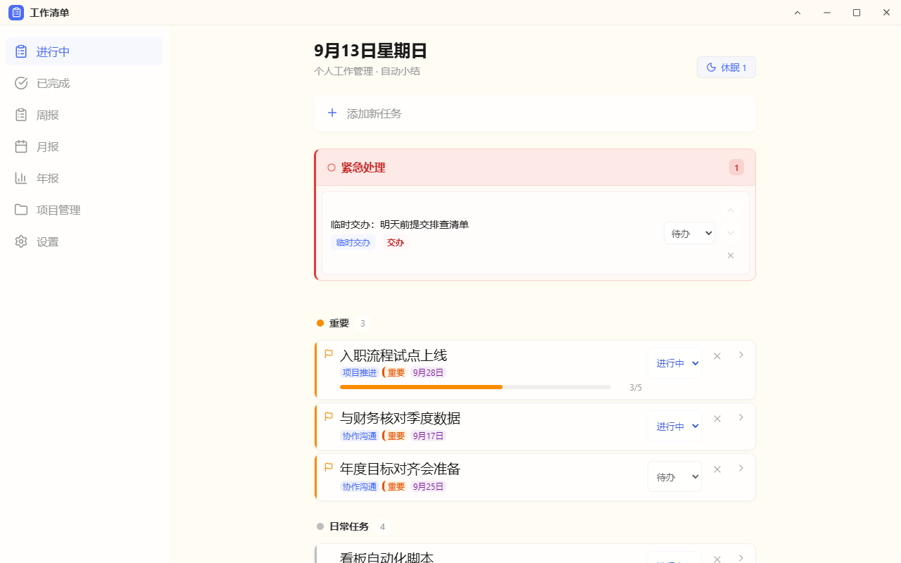
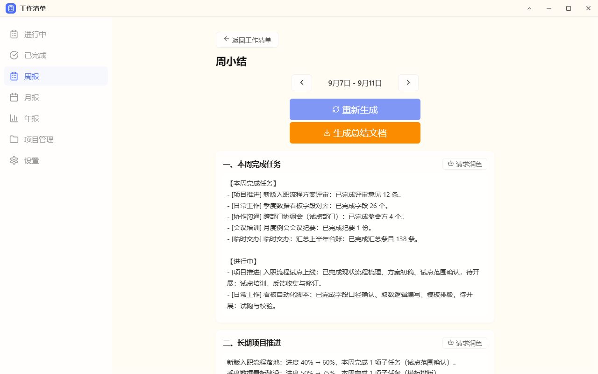

# 工作清单 · Work Journal

> 每日任务管理 + 周/月/年小结自动生成。**数据只录一次，报告随时可出。**

[](LICENSE)
[](#系统要求)
[](#技术方案)
[](#开发)

[English](README.en.md) · 中文

<p align="center">
  
</p>

## 为什么做这个

日常忙起来很少记录，到年底回顾时只能凭记忆拼凑，容易遗漏重要工作成果。

这个工具把"记录"融进日常流程：每天管理 to-do 的时候顺手记下产出，周末一键生成周小结，月底自动聚合月报，年底按工作板块归纳年度报告。**不用专门抽出时间写总结——总结是日常记录的副产品。**

## 它和普通 to-do 应用的区别

|          | 普通 to-do 应用   | 工作清单                                                          |
| -------- | ----------------- | ----------------------------------------------------------------- |
| 关注点   | 事情有没有做完    | 做完的事**产生了多少产出**（量化指标：审查 15 人次、汇总 138 条） |
| 长期任务 | 一个勾选框        | 父子任务拆解 + 进度条 + 跨周推进记录                              |
| 周期回顾 | 自己翻历史        | 周/月/年小结**自动从数据生成**，一键复制或导出 Word               |
| 数据归属 | 厂商服务器 + 账号 | 你自己的**一个 JSON 文件**，放哪个文件夹由你决定                  |
| 离线     | 多数要联网        | 纯前端 PWA，断网可用                                              |
| 安装     | 装软件、要权限    | 浏览器里"安装"，不需要管理员权限                                  |

## 三个核心能力

### 1. 每日任务管理

- 优先级三级（🔴紧急 / 🟡重要 / 🟢日常），紧急任务独立顶置区（最多 5 条）
- 长期项目拆成子任务，卡片上直接看到 `3/5` 进度
- 多项量化产出录入，如"完成 3 项""处理 15 件"
- 交办事项标记（来源 / 交办时间 / 完成时限），不遗漏外部委托
- 跨年任务可休眠：平时不占空间，临近截止自动出现

### 2. 周 / 月 / 年小结自动生成

<p align="center">
  
</p>

- **周小结**：本周完成任务 → 长期项目推进 → 下周计划 → 需协调事项；下周计划里新增的条目会自动回填为任务
- **月小结**：量化产出汇总表 + 任务/项目推进 + 月度反思 + 下月重点
- **年度报告**：按六个工作维度归纳（日常工作 / 项目推进 / 协作沟通 / 会议培训 / 临时交办 / 其他事务），维度随分类调整；附月度趋势表与全年量化总表
- 一键复制纯文本（直接粘到邮件或 OA），或导出为 **Word 文档**

### 3. AI 润色（可选，默认关闭）

- 独立的 Python 命令行脚本，读取同一份 `data.json`，把小结语言润色为正式、简洁、结构化的书面语
- 润色结果始终可手动编辑，最终修改权在你
- 支持 DeepSeek / 通义千问等任何 OpenAI 兼容接口
- **不润色也能用**——AI 只是锦上添花

## 快速开始

### 想先看看效果？

[`demo/data.json`](demo/data.json) 是一份虚构的示例数据（含项目、子任务、量化产出、周/月/年归档），导入后立刻能看到完整效果：

```bash
git clone https://github.com/linhuanwen/work-tracker-pwa.git
cd work-tracker-pwa
python scripts/make_demo_data.py   # 以当天日期重新生成示例数据（可选）
```

把 `demo/data.json` 复制到你自己的工作文件夹，或在应用里直接选择 `demo/` 文件夹。

### 方式一：直接使用预打包 exe（Windows，零安装）

1. 下载 `release/` 文件夹到本地
2. 确保系统已安装 [WebView2 Runtime](https://developer.microsoft.com/en-us/microsoft-edge/webview2/)（Windows 11 已内置）
3. 双击 `工作清单.exe` 运行（首次运行会自动在桌面创建"工作清单"快捷方式，exe 本体可放在任意目录）
4. 首次运行选择数据文件存放位置（建议放在云同步文件夹中）

### 方式二：PWA 模式（浏览器）

```bash
npm install
npm run build

# 启动本地服务器（无窗口，纯 HTTP，含完整 API）
python run.py --headless
# 或: python -m launcher --headless
# 或: npx serve dist
```

然后浏览器打开 `http://127.0.0.1:5173`，浏览器菜单 → "安装" → 钉到任务栏。

### 方式三：从源码运行桌面版

```bash
npm install
npm run build

pip install pywebview pystray Pillow python-docx requests

python run.py       # 或 python -m launcher
```

详细说明见 [docs/INSTALL.md](docs/INSTALL.md)。

### 方式四：一条命令出包（发布 / 更新 release）

```bash
python scripts/build_release.py
```

依次执行：前端构建 → 生成图标 → PyInstaller 打包 → 更新 `release/工作清单/` → 生成 `release/工作清单.zip`。

可选参数：`--skip-frontend`（跳过前端构建）、`--skip-installer`（只重新拷贝已有 exe 并打包 zip）。

## 数据与隐私

- **数据是你的一个文件**：全部内容存在单个 `data.json` 里，看得见、拷得走、可加进版本管理
- **没有账号、没有服务器**：应用是纯前端 PWA，不向任何第三方上传数据
- **自动备份**：每次保存前把旧文件轮转为 `data.json.bak`（保留最近 5 份）；文件损坏时另存为 `data.json.corrupt-<时间戳>` 并提示，绝不在坏数据上继续跑
- **AI 润色是唯一的外部调用**，且只在你主动运行脚本时发生，只发送待润色的文字段落
- **跨设备同步**：把 `data.json` 放进任一云同步文件夹（OneDrive / 坚果云 / WPS 云文档等），手机浏览器打开同一套 PWA 指向该文件即可

## 技术方案

```
┌──────────────────┐       ┌──────────┐       ┌──────────────────┐
│   Windows 桌面    │       │ 云盘同步  │       │  其他设备          │
│                  │       │          │       │                  │
│  桌面启动器 (exe)  │── 读写 ──→ data.json ←── 同步 ──→ 手机/其他电脑    │
│  PWA 独立窗口     │       │          │       │                  │
└──────────────────┘       └──────────┘       └──────────────────┘
```

- **前端**：React 18 + Vite + TypeScript + vite-plugin-pwa
- **数据**：单一 `data.json`，File System Access API 直接读写本地文件
- **桌面启动器**：Python + pywebview（WebView2），无边框透明窗口 + 系统托盘，可打包为单文件 exe
- **AI 脚本**：独立 Python 脚本，命令行运行
- **零后端**：不需要服务器、不需要数据库、不需要部署

## 项目结构

```
/
├── README.md
├── docs/
│   ├── INSTALL.md                   ← 安装指南
│   ├── USER-GUIDE.md                ← 使用手册
│   ├── screenshots/                 ← 截图
│   └── specs/                       ← 设计规格文档
├── src/                             ← React 前端源码（utils 纯函数层 + 组件）
├── launcher/                        ← 桌面启动器 + HTTP 服务器包（--headless 纯服务器模式）
├── scripts/                         ← AI 润色、出包、示例数据、质量门禁脚本
├── demo/data.json                   ← 示例数据（可导入试用）
├── public/                          ← PWA 图标与静态资源
├── run.py                           ← 桌面启动器入口
└── release/                         ← 打包产物
```

## 开发

```bash
npm install
npm run dev           # 前端热更新
npm test              # 前端测试（vitest）
npm run lint          # ESLint
npm run format:check  # Prettier 校验

# 一次跑完全部门禁：前端 typecheck / lint / format / test + ruff + pytest
python scripts/check_all.py
```

## 系统要求

| 要求               | 说明                                       |
| ------------------ | ------------------------------------------ |
| 操作系统           | Windows 10+ 或 Windows 11                  |
| 浏览器（PWA 模式） | Chrome / Edge 较新版本                     |
| WebView2 Runtime   | Windows 11 已内置；Windows 10 可能需要安装 |
| Python（可选）     | 3.11+，仅从源码运行或 AI 润色时需要        |

## 文档

- [安装指南](docs/INSTALL.md)
- [使用手册](docs/USER-GUIDE.md)
- [设计规格](docs/specs/)

## 贡献

Issue 与 PR 都欢迎——先在 [Issues](https://github.com/linhuanwen/work-tracker-pwa/issues) 里聊清楚需求再动手，避免白做。提交前请跑一遍 `python scripts/check_all.py`。

## License

[MIT](LICENSE)
